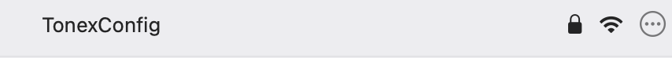
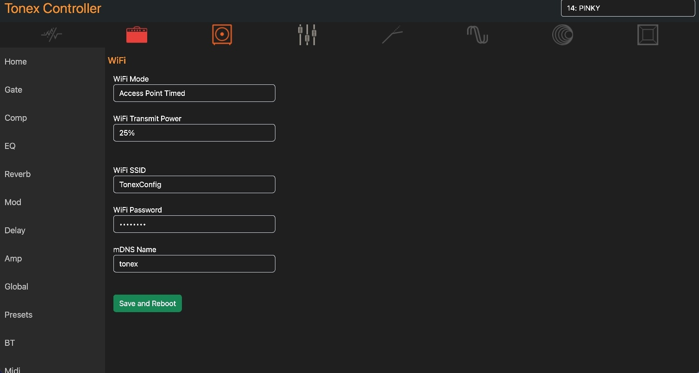
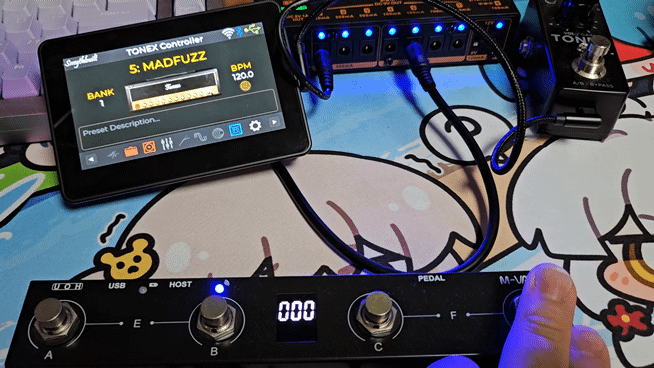

# Tonex One Controller, using esptools in MAC
---
I suffered connecting to MIDI pedal(M-vave chocolate plus) with Tonex One Controller using bluetooth.
But thanks to [Tonex One Controller step-by-step guide](https://gsus4.com.au/blogs/news-promo/what-if-there-was-a-screen-for-ik-tonex-one-step-by-step-guide), 
I finally connect MIDI pedal with ESP32-S3.

And I also get help from this [video(in Korean)](https://www.youtube.com/watch?v=N3tHei5sb-Q)

---
## How to make Tonex One Controller in MAC?
First, you need Tonex One, C-to-C cable, M-vave Chocolate plus, ESP32-S3, and MAC(because this is MAC guide). 
Next, you need to go to [TonexOneController git project](https://github.com/Builty/TonexOneController) and click Releases folder.

Then, select the version you want(I use V2.0.1.2, the latest one), and click that folder.
And you can see many zip files. Select appropriate zip file, and download it.
(If your device is ESP32-S3, download Waveshare_4_3B_Display_Amp_Skins.zip)

---
### flash download with Python esptool
After finishing download, unzip the file and you need to download Python - esptool library.
```
pip install esptool 
```
You can check if esptool is installed by this command.
```
esptool.py version
```
When you are ready, connect ESP32-S3 with MAC using C-to-C cable.
*CAUTION. When you connect to MAC, YOU MUST CONNECT DEVICE WITH BOOT BUTTON PRESSED*
Then, you can find device by using this prompt.
```
ls -l /dev/tty.*
```
In my case, my device name was tty.usbmodem101.

If you are success to find device, then go to your downloaded TonexOneController folder.
After that, use this command
```
esptool.py --chip esp32s3 \                                        
  --port /dev/tty.usbmodem101 \
  --baud 460800 \
  --before default_reset \
  --after hard_reset \
  write_flash -z \
  --flash_mode dio \
  --flash_freq 40m \
  --flash_size detect \
  0x0 bin/bootloader.bin \
  0x8000 bin/partition-table.bin \
  0xd000 bin/ota_data_initial.bin \
  0x10000 bin/TonexController.bin
```
If not worked, use sudo option.

After finished, reboot your device. And you can see flash is installed in yours.

---
### Connect MIDI pedal with TonexOneController using bluetooth
Before performing this step, your TonexOneController device(ESP32-S3) and Tonex one need to be connected by C-to-C cable, ike this photo.


---
#### Connect Tonex one's local WIFI
After TonexOneController is booted, in few seconds, Tonex one's local WIFI will be shown.

This WIFI will soon be gone, so you need to catch WIFI named TonexConfig in at least 10 secs. 


the password is ***12345678***

If you succeed to connect tonex one local WIFI, you need to go [this site](https://tonex.local) or http://192.168.4.1 immediately.


Then, select BT menu, set settings so that TonexOneController can find MIDI pedal.

After this, go to External Footswitch menu, and select preset switch to '1x2 Next/Previous'.

And then...your controller is now connected with MIDI pedal!

